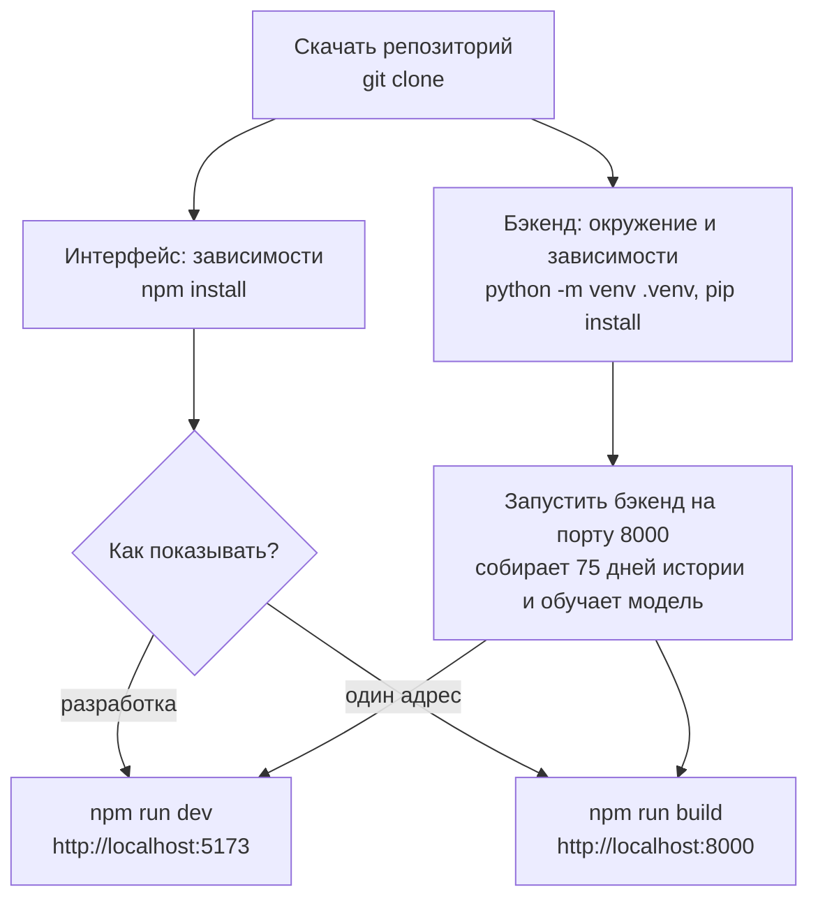
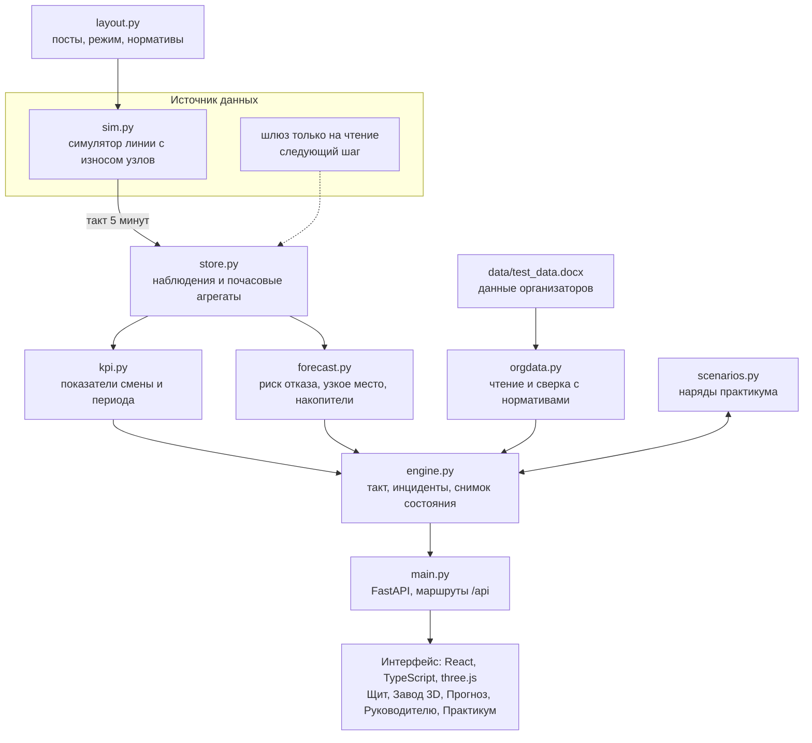
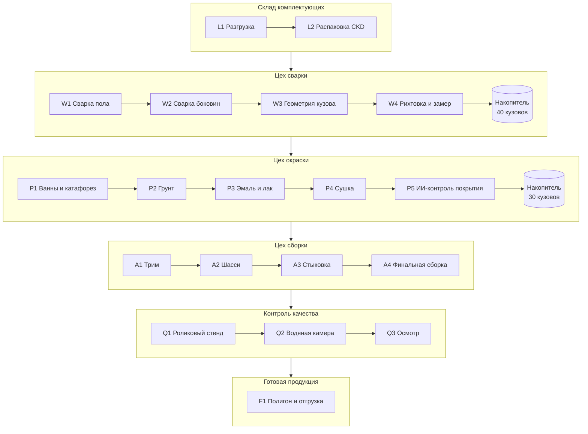
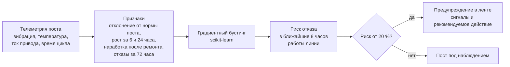
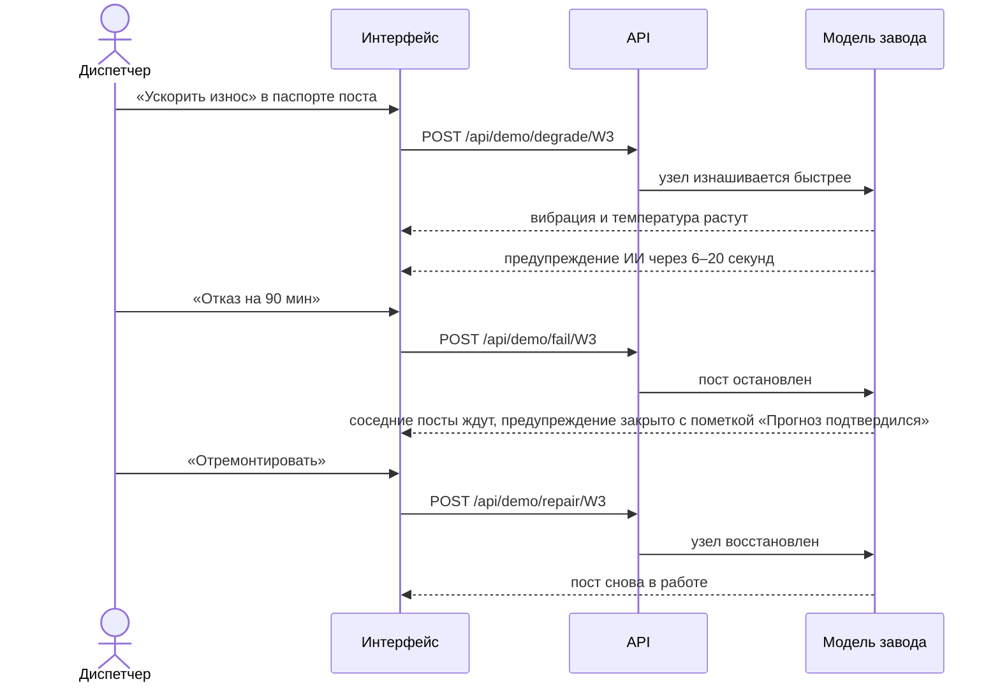
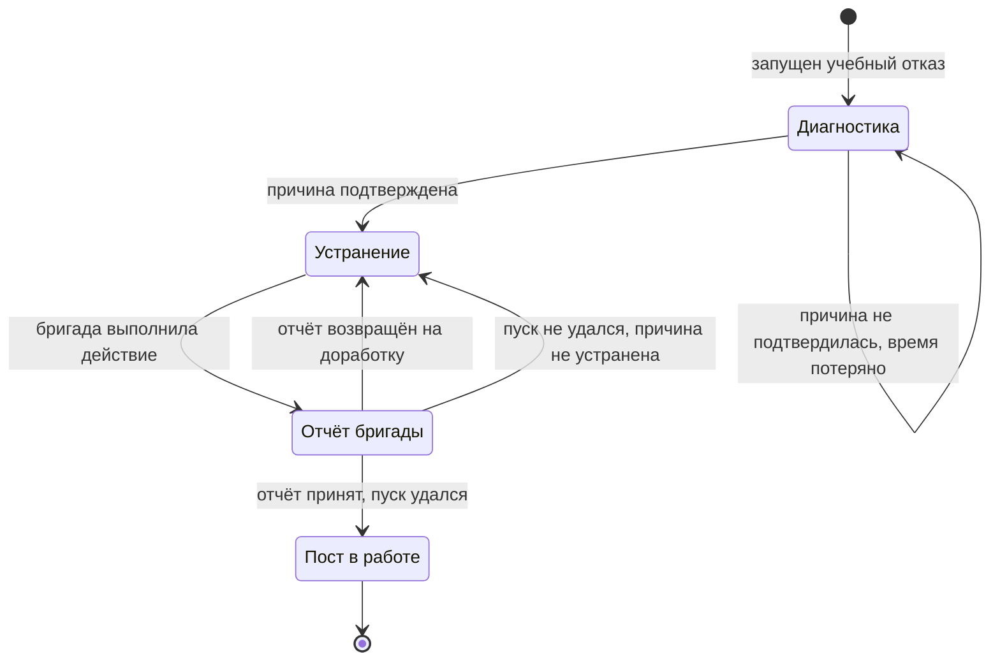

# Установка, запуск и схемы

Пошаговая инструкция к прототипу «Двойник завода» (кейс №2, АО «Группа компаний АЛЛЮР»). Описание возможностей и модели — в [README.md](README.md), презентация — в [presentation/ceres-dvoinik-zavoda.pdf](presentation/ceres-dvoinik-zavoda.pdf).

## Что понадобится

| Что | Версия | Зачем |
| --- | --- | --- |
| Python | 3.12 | бэкенд: модель линии, показатели, прогноз |
| Node.js | 20 или новее | сборка и запуск интерфейса |
| Git | любая | скачать репозиторий |
| Браузер | с поддержкой WebGL | экран «Завод 3D» |

Интернет нужен только на время установки зависимостей. Данные завода и тестовый файл организаторов уже лежат в репозитории.

## Порядок запуска



## 1. Скачать

```bash
git clone https://github.com/Knikaut/IndustryHackathon_thirds.git
cd IndustryHackathon_thirds
```

Без Git: кнопка **Code → Download ZIP** на странице репозитория, затем распаковать архив и открыть папку в терминале.

## 2. Установить и запустить бэкенд

Windows:

```bash
cd backend
python -m venv .venv
.venv\Scripts\pip install -r requirements.txt
.venv\Scripts\python -m uvicorn app.main:app --port 8000
```

macOS и Linux:

```bash
cd backend
python3 -m venv .venv
.venv/bin/pip install -r requirements.txt
.venv/bin/python -m uvicorn app.main:app --port 8000
```

При старте бэкенд генерирует 75 дней истории и обучает модель прогноза. Это занимает несколько секунд; окно терминала нужно оставить открытым.

## 3. Установить и запустить интерфейс

Во втором окне терминала, из корня репозитория:

```bash
cd frontend
npm install
npm run dev
```

Интерфейс откроется на http://localhost:5173. Пока бэкенд не ответил, на экране надпись «Собираю историю и обучаю модель прогноза…».

## 4. Открыть

| Адрес | Что там |
| --- | --- |
| http://localhost:5173 | «Щит»: мнемосхема линии, показатели смены, лента инцидентов |
| http://localhost:5173/#twin | «Завод 3D»: площадка и оборудование в объёме |
| http://localhost:5173/#twin/W3 | 3D-сцена, камера сразу у поста W3 |
| http://localhost:5173/#forecast | «Прогноз»: риск отказа по постам, метрики модели |
| http://localhost:5173/#exec | «Руководителю»: итоги, потери, план месяца |
| http://localhost:5173/#exec@effect | «Руководителю», сразу калькулятор эффекта |
| http://localhost:8000/scenarios | практикум отказов (нужна сборка интерфейса, см. ниже) |

Навигация идёт через хэш: адрес без него, например `/twin`, даёт 404.

## Показ с одного адреса

Чтобы не держать два процесса, интерфейс можно собрать — бэкенд сам отдаст его на http://localhost:8000:

```bash
cd frontend
npm run build
```

Если бэкенд был запущен до первой сборки, перезапустите его: папку со сборкой он подключает при старте. В таблице выше достаточно заменить `5173` на `8000`.

## Настройки

| Переменная | Где | Что делает |
| --- | --- | --- |
| `TWIN_NOW` | бэкенд | Момент старта модели в формате ISO, например `2026-10-09T10:00`. С одним и тем же значением история и метрики прогноза воспроизводятся от запуска к запуску. |
| `TWIN_API` | `npm run dev` | Адрес бэкенда для режима разработки, по умолчанию `http://127.0.0.1:8000`. |

Запуск с фиксированным моментом старта, macOS и Linux:

```bash
TWIN_NOW=2026-10-09T10:00 .venv/bin/python -m uvicorn app.main:app --port 8000
```

Windows:

```bash
set TWIN_NOW=2026-10-09T10:00
.venv\Scripts\python -m uvicorn app.main:app --port 8000
```

## Проверка

Из папки `backend`, macOS и Linux:

```bash
.venv/bin/python check.py
PYTHONPATH=. .venv/bin/python -m unittest test_scenarios -v
```

Windows:

```bash
.venv\Scripts\python check.py
set PYTHONPATH=.
.venv\Scripts\python -m unittest test_scenarios -v
```

`check.py` прогоняет движок без сервера, `test_scenarios` проверяет наряды практикума.

## Схемы

### Архитектура

Показатели, прогноз и API читают данные только из хранилища. Чтобы подключить реальную линию, меняется один модуль — источник.



### Линия двойника

Шесть цехов, 19 постов и два накопителя кузовов. Последовательность повторяет путь автомобиля на заводе; число постов и времена цикла условные.



### Прогноз отказов



Модель обучается на первых 75 % истории и проверяется на последних 25 %. Метрики проверки выводятся на экране «Прогноз» и считаются заново при каждом запуске. Телеметрия синтетическая: цифры описывают модель двойника, а не реальный завод.

### Сценарий показа

Кнопки сценария находятся в паспорте поста: клик по посту на «Щите» или в 3D-сцене.



### Практикум отказов

Страница `/scenarios`: диспетчер сам выбирает причину и действие. Двойник оборудованием не управляет, кнопки заменяют сообщения от людей.



## Если что-то не работает

| Что видно | Что сделать |
| --- | --- |
| «Жду сервер данных…» не пропадает | Бэкенд не запущен или занят другой порт. Запустите его командой из шага 2. |
| Порт 8000 занят | Запустите бэкенд на другом порту, например `--port 8001`, а интерфейс — с `TWIN_API=http://127.0.0.1:8001 npm run dev` (в Windows сначала `set TWIN_API=http://127.0.0.1:8001`, затем `npm run dev`). |
| `/scenarios` отвечает «Сначала соберите интерфейс» или открывается пустая страница | Выполните `npm run build` в папке `frontend` и перезапустите бэкенд. |
| «Завод 3D» идёт рывками | Откройте экран заранее на том компьютере, с которого идёт показ; на слабой видеокарте сцена тяжёлая. |
| На проекторе 1024×768 страница прокручивается | Поставьте масштаб браузера 80 %. |
| Цифры отличаются от запуска к запуску | Задайте `TWIN_NOW`, см. раздел «Настройки». |
